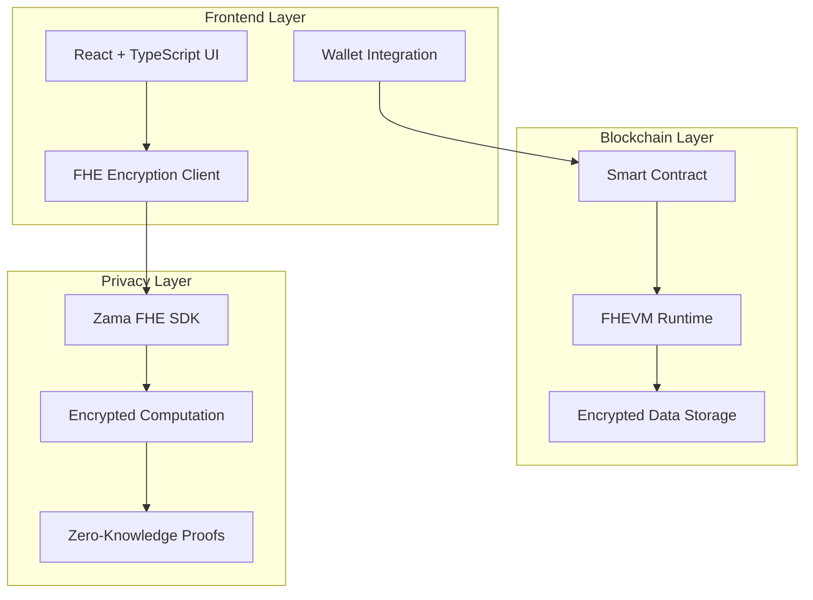

# 🔐 CipheredMicroloan Bazaar

> **Privacy-First Microloan Marketplace Powered by Fully Homomorphic Encryption**

A revolutionary decentralized lending platform that enables secure, private microloans for underserved communities worldwide. Built on Zama's cutting-edge FHE technology, this platform ensures complete financial privacy while maintaining transparent and fair lending practices.

## 🌟 **Key Features**

### 🔒 **Privacy by Design**
- **Fully Homomorphic Encryption (FHE)**: All sensitive financial data remains encrypted during processing
- **Zero-Knowledge Lending**: Lenders can assess risk without accessing personal financial information
- **Decentralized Privacy**: No central authority can view or control user data

### 💰 **Smart Lending Infrastructure**
- **Multi-Lender Pooling**: Multiple investors can fund a single loan, reducing individual risk
- **Automated Credit Scoring**: AI-powered risk assessment using encrypted data
- **Flexible Repayment**: Monthly installment plans with transparent interest calculation
- **Global Accessibility**: Cross-border lending without traditional banking intermediaries

### 🎯 **User-Centric Design**
- **Intuitive Interface**: Clean, responsive design optimized for mobile and desktop
- **Real-Time Updates**: Live loan status tracking and funding progress
- **Multi-Language Support**: English interface with plans for global localization
- **Wallet Integration**: Seamless connection with MetaMask and other Web3 wallets

## 🏗️ **System Architecture**



### **Core Components**

#### 🧠 **Smart Contract System**
- **Loan Lifecycle Management**: 9-state workflow from application to completion
- **Role-Based Access Control**: Owner, Credit Analyst, Loan Officer, Collection Agent
- **Encrypted Data Processing**: All computations performed on encrypted data
- **Multi-Signature Security**: Critical operations require multiple approvals

#### 🔐 **Privacy Engine**
- **Client-Side Encryption**: Data encrypted before leaving user's device
- **Homomorphic Operations**: Risk assessment without decryption
- **Secure Key Management**: Distributed key generation and management
- **Audit Trail**: Transparent transaction history while preserving privacy

#### 💻 **Frontend Application**
- **Modern React Architecture**: Built with TypeScript for type safety
- **Responsive Design**: Optimized for mobile-first experience
- **Real-Time Updates**: WebSocket integration for live data
- **Accessibility**: WCAG 2.1 compliant interface

## 🚀 **Technology Stack**

| Layer | Technology | Purpose |
|-------|------------|---------|
| **Blockchain** | Solidity 0.8.24 + FHEVM | Smart contract execution |
| **Privacy** | Zama FHE SDK 0.2.0 | Homomorphic encryption |
| **Frontend** | React 18 + TypeScript | User interface |
| **Web3** | Wagmi + RainbowKit | Wallet integration |
| **Styling** | Tailwind CSS + shadcn/ui | Modern UI components |
| **Build** | Vite + Hardhat | Development toolchain |
| **Network** | Sepolia Testnet | Ethereum test network |

## 📈 **Development Roadmap**

### **Phase 1: Core Prototype (2025 Q4)** ✅ **Current Phase**
- [x] Smart contract deployment on Sepolia testnet
- [x] Basic loan application system
- [x] Multi-lender funding mechanism
- [x] Encrypted data processing with FHE
- [x] Public demo platform (no real funds)

### **Phase 2: FHE Credit Scoring MVP (2026 H1)**
- [ ] On-chain FHE credit scoring model
- [ ] Privacy-preserving risk assessment
- [ ] Automated loan approval system
- [ ] Dynamic interest rate calculation
- [ ] Gateway-assisted decryption for risk tiers

### **Phase 3: Advanced Features (2026 H2)**
- [ ] Mobile application development
- [ ] Cross-chain compatibility
- [ ] Advanced analytics dashboard
- [ ] Integration with traditional finance
- [ ] Enhanced user experience

### **Phase 4: Production Launch (2027)**
- [ ] Mainnet deployment
- [ ] Security audit completion
- [ ] Regulatory compliance
- [ ] Community governance (DAO)
- [ ] Global market expansion

### **Future Vision (2027+)**
- [ ] **AI-Powered Risk Assessment**: Machine learning models trained on encrypted data
- [ ] **Cross-Border Compliance**: Automated regulatory compliance across jurisdictions
- [ ] **Institutional Integration**: Bridge between DeFi and traditional finance
- [ ] **Advanced Privacy Features**: Zero-knowledge proofs for enhanced privacy
- [ ] **Global Financial Inclusion**: Serving unbanked populations worldwide

## 🛠️ **Quick Start**

### **Prerequisites**
- Node.js 18+ 
- MetaMask wallet
- Sepolia ETH for gas fees

### **Installation**

```bash
# Clone the repository
git clone https://github.com/william2332-limf/CipheredMicroloan-Bazaar.git
cd CipheredMicroloan-Bazaar

# Install dependencies
npm install
cd frontend && npm install

# Start development server
npm run dev
```

### **Configuration**
> **Note**: All configuration is hardcoded for simplicity. The deployed contract address `0x8E5ed8d77cfCC22c05af221C9b08Ec021aAdbF4d` is already configured for Sepolia testnet.

## 📱 **User Guide**

### **For Borrowers**
1. **Connect Wallet**: Link your MetaMask wallet to the platform
2. **Apply for Loan**: Fill out the encrypted application form
3. **Credit Assessment**: Wait for automated risk evaluation
4. **Receive Funds**: Get approved loans directly to your wallet
5. **Make Payments**: Use the repayment interface for monthly installments

### **For Lenders**
1. **Browse Opportunities**: View available loan requests
2. **Assess Risk**: Review encrypted risk profiles
3. **Fund Loans**: Contribute to loans with desired amounts
4. **Earn Returns**: Receive interest payments automatically
5. **Track Portfolio**: Monitor your lending performance

### **For Credit Analysts**
1. **Review Applications**: Access encrypted loan applications
2. **Request Evaluations**: Trigger automated credit assessments
3. **Approve/Reject**: Make lending decisions based on risk data
4. **Monitor Performance**: Track loan performance and defaults

## 🔒 **Security & Privacy**

### **Privacy Protection**
- **End-to-End Encryption**: Data encrypted from user input to blockchain storage
- **Homomorphic Computation**: Risk assessment without data exposure
- **Zero-Knowledge Architecture**: No party can access raw financial data
- **Decentralized Storage**: No single point of failure or data breach

### **Security Measures**
- **Smart Contract Audits**: Regular security reviews and penetration testing
- **Role-Based Access**: Granular permissions for different user types
- **Multi-Signature Operations**: Critical functions require multiple approvals
- **Immutable Records**: All transactions recorded on blockchain

## 🌍 **Social Impact**

### **Financial Inclusion**
- **Global Access**: Serve unbanked populations worldwide
- **Low Barriers**: Minimal requirements for loan applications
- **Fair Rates**: Transparent, competitive interest rates
- **Community Support**: Peer-to-peer lending with social impact

### **Economic Empowerment**
- **Small Business Growth**: Enable entrepreneurship in developing regions
- **Education Funding**: Support educational expenses and skill development
- **Emergency Relief**: Provide quick access to funds during crises
- **Sustainable Development**: Align with UN Sustainable Development Goals

## 📊 **Current Status**

| Component | Status | Details |
|-----------|--------|---------|
| **Smart Contract** | ✅ Complete | Deployed on Sepolia testnet |
| **FHE Integration** | ✅ Complete | Zama SDK 0.2.0 integrated |
| **Frontend UI** | ✅ Complete | English interface, responsive design |
| **Wallet Integration** | ✅ Complete | MetaMask and Web3 wallet support |
| **Testing** | 🔄 In Progress | End-to-end functionality testing |
| **Security Audit** | 📋 Planned | Third-party security review |
| **Mainnet Deployment** | 📋 Planned | Production deployment |

## 🤝 **Contributing**

We welcome contributions from developers, researchers, and community members:

### **Development Areas**
- **Smart Contract Features**: New lending mechanisms and risk models
- **Frontend Improvements**: UI/UX enhancements and accessibility
- **Security Research**: Vulnerability assessments and privacy analysis
- **Documentation**: Technical guides and user tutorials

### **Getting Involved**
1. Fork the repository
2. Create a feature branch
3. Make your changes
4. Submit a pull request
5. Join our community discussions

## 📄 **License**

This project is licensed under the MIT License - see the [LICENSE](LICENSE) file for details.

## 🙏 **Acknowledgments**

- **Zama Team**: For pioneering FHE technology and providing the SDK
- **Ethereum Foundation**: For the robust blockchain infrastructure
- **Open Source Community**: For the amazing tools and libraries
- **Beta Testers**: For valuable feedback and bug reports

---

**Built with ❤️ for a more private, inclusive, and equitable financial future.**

*Empowering communities through privacy-preserving technology.*